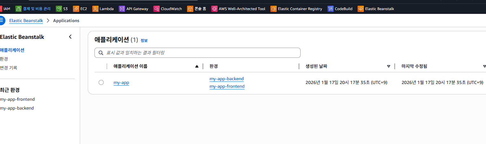
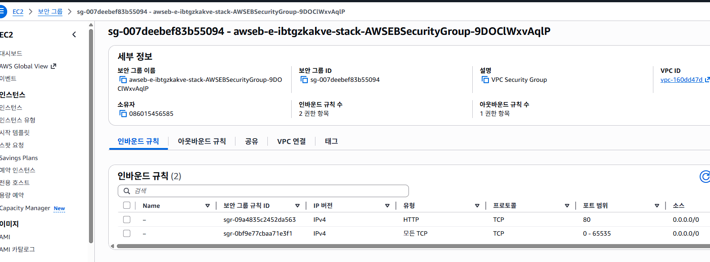

# GH Action -> AWS ECR
```
이 워크플로우에서 쓰는 ${{ secrets.XXX }} 값들은 GitHub 리포지토리(또는 조직) 설정에 “Secrets”로 만들어야 합니다.
워크플로우 파일 안에서 만드는 게 아니라, GitHub UI에서 등록해요.

1) 어디에 만드나? (가장 일반: Repo Secrets)

GitHub에서 해당 리포지토리 들어가기

Settings

왼쪽 메뉴 Secrets and variables → Actions

New repository secret 클릭

아래 이름/값을 각각 추가

이 워크플로우가 요구하는 Secrets 목록

AWS_REGION (예: ap-northeast-2)

AWS_ACCOUNT_ID (예: 123456789012)

ECR_FRONTEND_REPOSITORY (예: my-frontend)

ECR_SIGNALING_REPOSITORY (예: my-signaling)

AWS_ACCESS_KEY_ID

AWS_SECRET_ACCESS_KEY
```
### IAM 및 액세스키 생성


### Github 의 설정


### Action 진행 사항


### ECR 에 Repo 생성 확인


### Elastic Beantalk
```
A. 먼저 “프론트용 환경” 1개 만들기 (추천: my-app-frontend)
1) (이미 선택됨) 환경 티어 = 웹 서버 환경

지금처럼 웹 서버 환경 체크 그대로 두세요.

2) 애플리케이션 이름 = my-app

이미 입력하신 my-app 그대로 OK.

3) 아래쪽에 있는 환경 정보에서

환경 이름: my-app-frontend (예시)

도메인: 자동으로 잡히는 값(충돌 나면 다른 걸로)

환경 이름은 나중에 변경이 번거로우니, 프론트/시그널링 구분되게 이름을 추천합니다.

4) 다음(2단계)으로 이동
B. 2단계(서비스 액세스 구성)에서 “Docker 플랫폼” 선택
5) 플랫폼(Platform)

Docker 선택

가능하면 Amazon Linux 2023 running Docker(또는 최신 Docker 플랫폼) 선택

6) 환경 유형(비용 줄이려면)

처음 테스트면 단일 인스턴스(Single instance) 추천

운영이면 로드 밸런싱(Load balanced)

7) 역할(Role) 관련(중요)

여기 단계나 다음 단계에서 역할을 고르게 되는데:

EC2 인스턴스 프로파일 역할(예: aws-elasticbeanstalk-ec2-role)이 있어야 하고

이 역할에 ECR pull 권한이 있어야 합니다.

가장 쉬운 방법: 역할에 AmazonEC2ContainerRegistryReadOnly 정책 붙이기

이거 안 하면 배포할 때 “ECR에서 이미지 pull 실패”가 자주 납니다.
```


### aws-elasticbeanstalk-service-role 의 경우 environment
### aws-elasticbeanstalk-ec2-role 의 경우 compute


### Role name: aws-elasticbeanstalk-service-role (추천)


### 권한 추가 - AmazonEC2ContainerRegistryReadOnly


### 최종 권한 확인


### 다시 위의 과정


### 이 화면에서 role 불러오는데 시간걸림


### 아래와 같이 compute , service 의 2종류 role 에 대해 혼동이 많으니 상당한 주의가 필요함


### 사용하는 기본 VPC 환경


### 인스탄스 선택 - 기본으로


### 구성 중 - 최대 10분정도 대기


### 최종 화면


### 경고 있을 경우 확인


### role 가장 큰 문제로, 다음 작업이 필요할 수 있음.
방법 1) CloudShell로 서비스 연결 역할 생성 (가장 확실)
AWS 콘솔 상단에서 CloudShell(>_ 아이콘) 열고 아래 한 줄 실행:
```
aws iam create-service-linked-role --aws-service-name elasticbeanstalk.amazonaws.com
```
성공하면:
AWSServiceRoleForElasticBeanstalk 역할이 생성됩니다.

### Cloud Shell 에서
```
~ $ aws iam get-role --role-name AWSServiceRoleForElasticBeanstalk
{
    "Role": {
        "Path": "/aws-service-role/elasticbeanstalk.amazonaws.com/",
        "RoleName": "AWSServiceRoleForElasticBeanstalk",
        "RoleId": "AROARIBXLWVE3GC4XAKO7",
        "Arn": "arn:aws:iam::086015456585:role/aws-service-role/elasticbeanstalk.amazonaws.com/AWSServiceRoleForElasticBeanstalk",
        "CreateDate": "2026-01-17T12:00:25+00:00",
        "AssumeRolePolicyDocument": {
            "Version": "2012-10-17",
            "Statement": [
                {
                    "Effect": "Allow",
                    "Principal": {
                        "Service": "elasticbeanstalk.amazonaws.com"
                    },
                    "Action": "sts:AssumeRole"
                }
            ]
        },
        "MaxSessionDuration": 3600,
        "RoleLastUsed": {}
    }
}
~ $ 
```
### 여전히 권한 문제 시 권한 추가


### 배포



### Dockerrun.aws.json 파일 만들기 - 내용의 
```
{
  "AWSEBDockerrunVersion": 1,
  "Image": {
    "Name": "<Account-ID>.dkr.ecr.ap-northeast-2.amazonaws.com/<ECR_FRONTEND_REPO>:<TAG>",
    "Update": "true"
  },
  "Ports": [
    { "ContainerPort": "80" }
  ]
}
```
### 압축
```bash
zip -r eb.zip Dockerrun.aws.json
```


### S3 반영 확인


### 각자의 설정에 따라 여러 경우가 발생할 수 있음

```
위의 경우는 S3 버킷 이름이 빈 문자열("")로 들어갔습니다.
즉, GitHub Actions에서 EB_S3_BUCKET 값이 설정되지 않았거나 비어있어서, aws s3api create-bucket --bucket "" 같은 형태로 실행된 겁니다.

1) 가장 먼저 확인할 것 (GitHub Actions Secrets)

GitHub Repo → Settings → Secrets and variables → Actions → Secrets

여기에 아래 값이 정확히 존재해야 합니다.

EB_S3_BUCKET ✅ (현재 이게 비어있음)

(추가로 쓰는 값들) AWS_REGION, AWS_ACCOUNT_ID, EB_APPLICATION_NAME, EB_ENVIRONMENT_NAME 등

✅ 해결: EB_S3_BUCKET에 버킷 이름을 넣으세요. 예:

my-app-eb-deploy-086015456585-ap-northeast-2

S3 버킷 이름 규칙:

전부 소문자 권장

공백 금지

3~63자 권장 (S3 실제 규칙)

예: myapp-eb-bucket-086015456585
```
### 위의 경우 


### 오류 사항

```
EB_APPLICATION_NAME: 빈 값
EB_FRONTEND_ENVIRONMENT_NAME: 빈 값
EB_SIGNALING_ENVIRONMENT_NAME: 빈 값
```

```
  AWS_REGION: ${{ secrets.AWS_REGION }}
  AWS_ACCOUNT_ID: ${{ secrets.AWS_ACCOUNT_ID }}
  ECR_FRONTEND_REPOSITORY: ${{ secrets.ECR_FRONTEND_REPOSITORY }}
  ECR_SIGNALING_REPOSITORY: ${{ secrets.ECR_SIGNALING_REPOSITORY }}

  EB_APPLICATION_NAME: ${{ secrets.EB_APPLICATION_NAME }}
  EB_S3_BUCKET: ${{ secrets.EB_S3_BUCKET }}
  EB_FRONTEND_ENVIRONMENT_NAME: ${{ secrets.EB_FRONTEND_ENVIRONMENT_NAME }}
  EB_SIGNALING_ENVIRONMENT_NAME: ${{ secrets.EB_SIGNALING_ENVIRONMENT_NAME }}
```
### my-app-backend 도 설정


### backend용 Dockerrun.aws.json 예시
```
{
  "AWSEBDockerrunVersion": 1,
  "Image": {
    "Name": "086015456585.dkr.ecr.ap-northeast-2.amazonaws.com/my-signaling:<SHA 값>",
    "Update": "true"
  },
  "Ports": [
    { "ContainerPort": "3001" }
  ]
}
```
### 각 상황의 로그 분석


### 각 zip 파일 압축 및 업로드 필요
```
~/Docker-Vue/dockerrun-b$ zip -r eb.zip Dockerrun.aws.json
```
```
086015456585.dkr.ecr.ap-northeast-2.amazonaws.com/my-frontend:83df06adc0665c6d5b95dc9e216bceb0ecbf7778
```
### 위의 내용은 ECR 에서 확인


### ECR 관련

```
action yaml 에서 아래의 부분과 동일

      - name: Log in to Amazon ECR
        run: |
          aws ecr get-login-password --region "$AWS_REGION" \
            | docker login --username AWS --password-stdin "${AWS_ACCOUNT_ID}.dkr.ecr.${AWS_REGION}.amazonaws.com"

```

### EC2 현황


### 보안그룹 일단 모두 Any


### EC2 삭제 후 재 설치 여부 확인 및 해당 EC2 접속


```
sudo systemctl status docker --no-pager
sudo ls -al /var/app/staging
sudo sed -n '1,200p' /var/app/staging/Dockerrun.aws.json
```
---
### 소스의 json 과 다른 포맷으로 저장 되는 오류 있을 수 있음
```
[root@ip-172-31-38-134 ~]# sudo ls -al /var/app/staging
sudo sed -n '1,200p' /var/app/staging/Dockerrun.aws.json
total 4
drwxr-xr-x. 2 root root  32 Jan 18 01:00 .
drwxr-xr-x. 3 root root  21 Jan 18 01:00 ..
-rw-r--r--. 1 root root 239 Jan 18 00:54 Dockerrun.aws.json
{
  "AWSEBDockerrunVersion": 1,
  "Image": {
    "Name": "086015456585.dkr.ecr.ap-northeast-2.amazonaws.com/my-signaling:50475d4fe8296cda08816b6548bc5318a4a4d5a4",
    "Update": "true"
  },
  "Ports": [
    { "ContainerPort": 3001 }
  ]
}
```
---
```
[root@ip-172-31-38-134 ~]# sudo ls -al /opt/elasticbeanstalk/deployment/
sudo unzip -p /opt/elasticbeanstalk/deployment/app_source_bundle Dockerrun.aws.json | sed -n '1,120p'
total 16
drwxr-xr-x. 2 root root  111 Jan 18 00:55 .
drwxr-xr-x. 8 root root  144 Jan 18 00:55 ..
-rw-r--r--. 1 root root  380 Jan 18 01:00 app_source_bundle
-rw-r--r--. 1 root root  127 Jan 18 01:00 app_version_manifest.json
-rw-r--r--. 1 root root 6901 Jan 18 01:00 cfn-metadata-cache.json
-rw-r--r--. 1 root root    0 Jan 18 01:00 env.list
{
  "AWSEBDockerrunVersion": 1,
  "Image": {
    "Name": "086015456585.dkr.ecr.ap-northeast-2.amazonaws.com/my-signaling:50475d4fe8296cda08816b6548bc5318a4a4d5a4",
    "Update": "true"
  },
  "Ports": [
    { "ContainerPort": 3001 }
  ]
}
```
---
```
[root@ip-172-31-38-134 ~]# aws ecr describe-images \
  --region ap-northeast-2 \
  --repository-name my-signaling \
  --image-ids imageTag=50475d4fe8296cda08816b6548bc5318a4a4d5a4
{
    "imageDetails": [
        {
            "registryId": "086015456585",
            "repositoryName": "my-signaling",
            "imageDigest": "sha256:bc9fe803babb2562326843b026ddec06aa12b12d7587f820d3164fe8bfbdae13",
            "imageTags": [
                "50475d4fe8296cda08816b6548bc5318a4a4d5a4"
            ],
            "imageSizeInBytes": 122871219,
            "imagePushedAt": "2026-01-18T00:54:39.968000+00:00",
            "imageManifestMediaType": "application/vnd.docker.distribution.manifest.v2+json",
            "artifactMediaType": "application/vnd.docker.container.image.v1+json",
            "imageStatus": "ACTIVE"
        }
    ]
}
```
### json 의 숫자 타입에서 "" 사용 여부는 상황에 따라 좀 다를 수 있음
### BackEnd OK 내역


### Front End 의 nginx.conf 에서 서버의 URL 수정 필요
```
proxy_pass http://my-app-backend.eba-jnvhrxk5.ap-northeast-2.elasticbeanstalk.com;
```

### Front End OK 내역

```
ws = new WebSocket("ws://localhost:3001")
```
위의 소스 부분이 있다면 수정
```
ws = new WebSocket("ws://my-app-backend.eba-jnvhrxk5.ap-northeast-2.elasticbeanstalk.com")
```

### todo
> .env 를 이용한 dev, prod 의 환경 구성
> ECR 이미지의 latest 버젼으로 배포 자동 구성 또는 최종 태그 이미지만 반영
trigger workflow
